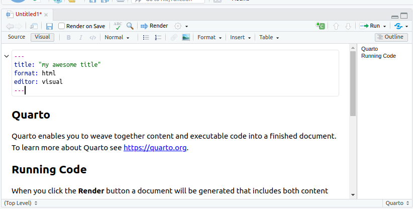
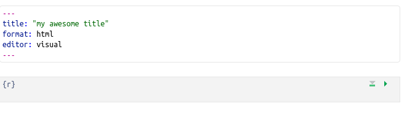
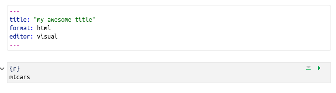
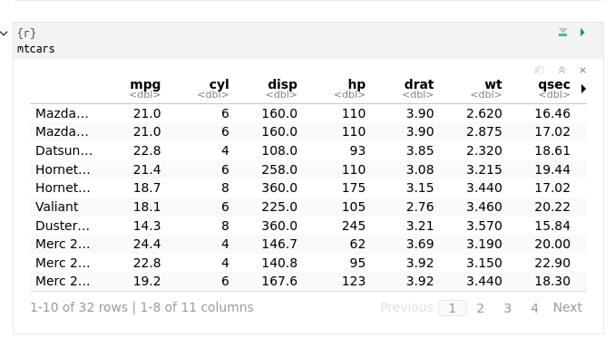
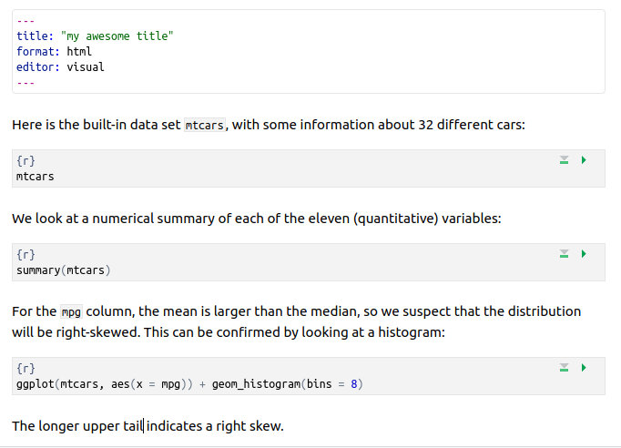
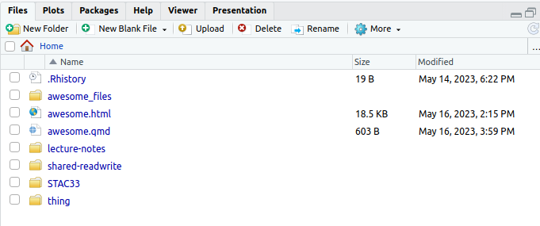
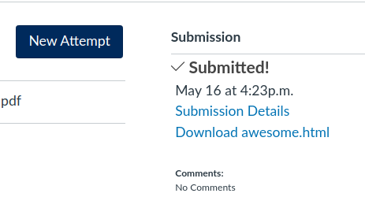

## Getting started

This question is to get you started using R.

(a) Start R Studio on `r.datatools` (or on your computer), in some
    project. (If you started up a new project in the previous question
    and are still logged in, use that; if not, create a new project with
    File, New Project, and New Directory. Then select New Project and
    give it a name. Click Create Project. This will give you an empty
    workspace to start from.)

Solution

You ought to see something like this:


There should be one thing on the left half, and at the top right it'll
say "Environment is empty".

Extra: if you want to tweak things, select Tools (at the top of the
screen) and from it Global Options, then click Appearance. You can make
the text bigger or smaller via Editor Font Size, and choose a different
colour scheme by picking one of the Editor Themes (which previews on the
right). My favourite is Tomorrow Night Blue. Click Apply or OK when you
have found something you like. (I spend a lot of time in R Studio, and I
like having a dark background to be easier on my eyes.)

$\blacksquare$

(b) We're going to do some stuff in R here, just to get used to it.
    First, make a Quarto document by selecting File, New File and Quarto
    Document.

Solution

In the first box that pops up, you'll be invited to give your document a
title. Make something up for now.

The first time, you might be invited to "install some packages" to make
the document thing work.[^1] Let it do that by clicking Yes. After that,
you'll have this:

[^1]: Especially if you are on your own computer.



A couple of technical notes:

-   this should be in the top left pane of your R Studio now, with the
    Console below it.

-   At the top of the file, between the two lines with three hyphens
    (minus signs, whatever), is some information about the document,
    known in the jargon as a YAML block, any of which you can change:

    -   the title is whatever title you gave your document

    -   the `format`is what the *output* is going to be (in this case,
        HTML like a webpage, which is mostly what we'll be using)

    -   there is a visual editor that looks like Notion or a bit like a
        Google doc (the default), and also a Source editor which gives
        you more control, and shows that underlying the document is a
        thing called R Markdown (which is a code for writing documents).

-   My *document* is called "My awesome title", but the *file* in which
    the document lives is still untitled because I haven't saved it yet.
    See right at the top.

$\blacksquare$

(c) You can delete the template code below the YAML block now (that is,
    everything from the title "Quarto" to the end). Somewhere in the
    space opened up below the YAML block (it might say "Heading 2",
    greyed out), type a /. This, like Notion, gives you a list of things
    to choose from to insert there. Pressing Enter will insert a "code
    chunk", sometimes known as a "code cell". We are going to use this
    in a moment.

Solution

Something like this:



The {r} at the top of the code chunk means that the code that will go in
there will be R code (you can also have a Python code chunk, among
others).

$\blacksquare$

(d) On the line below the `{r}`, type these two lines of code into the
    chunk in the Quarto document:

```{verbatim}
library(tidyverse)
mtcars
```

Solution

What this will do: get hold of a built-in data set with information
about some different models of car, and display it.



In approximately five seconds, you'll be demonstrating that for
yourself.

$\blacksquare$

(e) Run this command. To do that, look at the top right of your code
    chunk block (shaded in a slightly different colour). You should see
    a down arrow and a green "play button". Click the play button. This
    will run the code, and show the output below the code chunk.

Solution

Here's what I get (yours should be the same):



This is a rectangular array of rows and columns, with individuals (here,
cars) in rows and variables in columns, known as a "dataframe". When you
display a dataframe in an Quarto document, you see 10 rows and as many
columns as will fit on the screen. At the bottom, it says how many rows
and columns there are altogether (here 32 rows and 11 columns), and
which ones are being displayed.

You can see more rows by clicking on Next, and if there are more
columns, you'll see a little arrow next to the rightmost column (as here
next to `am`) that you can click on to see more columns. Try it and see.
Or if you want to go to a particular collection of rows, click one of
the numbers between Previous and Next: 1 is rows 1--10, 2 is rows
11--20, and so on.

The column on the left without a header (containing the names of the
cars) is called "row names". These have a funny kind of status, kind of
a column and kind of not a column; usually, if we need to use the names,
we have to put them in a column first.

In future solutions, rather than showing you a screenshot, expect me to
show you something like this:

```{r r0-1, eval=F}
library(tidyverse)
mtcars
```

```{r r0-2, echo=F}
mtcars %>% rownames_to_column("car") %>% as_tibble()
```

The top bit is the code, the bottom bit the output. In this kind of
display, you only see the first ten rows (by default).[^2]

[^2]: This document was actually produced by literally running this
    code, a process known as "rendering", which we will learn about
    shortly.

If you don't see the "play button", make sure that what you have really
is a code chunk. (I often accidentally delete one of the special
characters above or below the code chunk). If you can't figure it out,
delete this code chunk and make a new one. Sometimes R Studio gets
confused.

On the code chunk, the other symbols are the settings for this chunk
(you have the choice to display or not display the code or the output or
to not actually run the code). The second one, the down arrow, runs all
the chunks prior to this one (but not this one).

Your output has its own little buttons (as seen on the screenshot). The
first one pops the output out into its own window; the second one shows
or hides the output, and the third one deletes the output (so that you
have to run the chunk again to get it back). Experiment. You can't do
much damage here.

$\blacksquare$

(f) Something a little more interesting: `summary` obtains a summary of
    whatever you feed it (the five-number summary plus the mean for
    numerical variables). Obtain this for our data frame. To do this,
    create a new code chunk below the previous one, type
    `summary(mtcars)` into the code chunk, and run it.

Solution

This is what you should see:


or the other way:

```{r r0-3 }
summary(mtcars)
```

For the gas mileage column `mpg`, the mean is bigger than the median,
and the largest value is unusually large compared with the others,
suggesting a distribution that is skewed to the right.

There are 11 numeric (quantitative) variables, so we get the five-number
summary plus mean for each one. Categorical variables, if we had any
here, would be displayed a different way.

$\blacksquare$

(g) Let's make a histogram of the gas mileage data. Type the code below
    into another new code chunk, and run it:

```{verbatim}
ggplot(mtcars, aes(x = mpg)) + geom_histogram(bins = 8)
```

The code looks a bit wordy, but we'll see what all those pieces do later
in the course (like, maybe tomorrow).

Solution

This is what you should see:

```{r r0-4 }
ggplot(mtcars, aes(x = mpg)) + geom_histogram(bins = 8)
```

The long right tail supports our guess from before that the distribution
is right-skewed.

$\blacksquare$

(h) Some aesthetics: Add some narrative text above and below your code
    chunks. Above the code chunk is where you say what you are going to
    do (and maybe why you are doing it), and below is where you say what
    you conclude from the output you just obtained. I find it looks
    better if you have a blank line above and below each code chunk.

Solution

This is what I wrote (screenshot), with none of the code run yet. My
`library(tidyverse)` line seems to have disappeared, but yours should
still be there:



$\blacksquare$

(i) Save your Quarto document (the usual way with File and Save). This
    saves it *on the jupyter servers* (and not on your computer). This
    means that when you come back to it later, even from another device,
    this document will still be available to you. (If you are running R Studio on your own computer, it is much simpler: the Quarto document is on that computer, in the folder associated with the project you created.)

Now click Render. This produces a pretty HTML version of your Quarto
document. This will appear in a new tab of your web browser, which you
might need to encourage to appear (if you have a pop-up blocker) by
clicking a Try Again.

Solution

If there are any errors in the rendering process, these will appear in
the Render tab. The error message will tell you where in your document
your error was. Find it and correct it.[^3] Otherwise, you should see
your document.

[^3]: A big part of coding is dealing with errors. You will forget
    things, and it is fine. In the same way that it doesn't matter how
    many times you get knocked down, it's key that you get up again each
    time: it doesn't matter how many errors you made, it's key that you
    fix them. If you want something to sing along with while you do this, I recommend [this](https://www.youtube.com/watch?v=2H5uWRjFsGc). 

Extra 1: the rendering process as you did it doesn't produce that nice
display of a dataframe that I had in one of my screenshots. To get that,
alter the YAML block to read:

```{verbatim}
format: 
  html:
     df-print: paged
```

This way, anyone reading your document can actually page through the
dataframes you display in the same way that you did, to check that they
contain the right things.

Extra 2: you might prefer to have a preview of your document within R
Studio. To make this happen, look for the gear wheel to the right of
Render. Click the arrow beside it, and in the drop-down, click on
Preview in Viewer Pane. Render again, and you'll see the rendered
version of your document in a Viewer pane on the right. This puts the
thing you're writing and what it will look like side by side.

Extra 3: you might be annoyed at having to remember to save things. If
you are, you can enable auto-saving. To do this, go to Tools and select
Global Options. Select Code (on the left) and Saving (at the top). Click
on Automatically Save when editor loses focus, to put a check mark in
the box on the left of it. Change the pull-down below that to Save and
Write Changes. Click OK. Now, as soon as you pause for a couple of
seconds, everything unsaved will be saved.

$\blacksquare$

(j) Practice handing in your rendered Quarto document, as if it were an
    assignment that was worth something. (It is good to get the practice
    in a low-stakes situation, so that you'll know what to do next
    week.)

Solution

There are two steps: download the HTML file onto your computer, and then
handing it in on Quercus. To download: find the HTML file that you want
to download in the Files pane on the right. You might need to click on
Files at the top, especially if you had a Viewer open there before:



I called my Quarto document `awesome`and the file I was working on was
called `awesome.qmd`(which stands for "Quarto Markdown"). That's the
file I had to render to produce the output. My output file itself is
called `awesome.html.`That's the file I want to hand in. If you called
your file something different when you saved it, that's the thing to
look for: there should be something ending in `.qmd` and something with
the same first part ending in `.html`.

Click the checkbox to the left of the HTML file. Now click on More above
the bottom-right pane. This pops up a menu from which you choose Export.
This will pop up another window called Export Files, where you put the
name that the file will have on your computer. (I usually leave the name
the same.) Click Download. The file will go to your Downloads folder, or
wherever things you download off the web go.

Now, to hand it in. Open up Quercus at `q.utoronto.ca`, log in and
navigate to this course. Click Assignments. Click (the title of)
Assignment 0. There is a big blue Start Assignment button top right.
Click it. You'll get a File Upload at the bottom of the screen. Click
Choose File and find the HTML file that you downloaded. Click Open (or
equivalent on your system). The name of the file should appear next to
Choose File. Click Submit Assignment. You'll see Submitted at the top
right, and below that is a Submission Details window and the file you
uploaded.



You should be in the habit of *always* checking what you hand in, by
downloading it again and looking at it to make sure it's what you
thought you had handed in.

If you want to try this again, you can try again as many times as you
like, by making a New Attempt. (For the real thing, you can use this if
you realize you made a mistake in something you submitted. The graders'
instructions, for the real thing, are to grade the *last* file
submitted, so in that case you need to make sure that the last thing
submitted before the due date includes *everything* that you want
graded. Here, though, it doesn't matter.)

$\blacksquare$

(k) Optional extra. Something more ambitious: make a scatterplot of gas
    mileage `mpg`, on the $y$ axis, against horsepower, `hp`, on the
    $x$-axis.

Solution

That goes like this. I'll explain the steps below.

```{r r0-5 }
library(tidyverse)
ggplot(mtcars, aes(x=hp, y=mpg)) + geom_point()
```

This shows a somewhat downward trend, which is what you'd expect, since
a larger `hp` value means a more powerful engine, which will probably
consume more gas and get *fewer* miles per gallon. As for the code: to
make a `ggplot` plot, as we will shortly see in class, you first need a
`ggplot` statement that says what to plot. The first thing in a `ggplot`
is a data frame (`mtcars` here), and then the `aes` says that the plot
will have `hp` on the $x$-axis and `mpg` on the $y$-axis, taken from the
data frame that you specified. That's all of the what-to-plot. The last
thing is how to plot it; `geom_point()` says to plot the data values as
points.

You might like to add a regression line to the plot. That is a matter of
adding this to the end of the plotting command:

```{r r0-6 }
ggplot(mtcars, aes(x=hp, y=mpg)) + geom_point() + geom_smooth(method="lm")
```

The line definitely goes downhill. Decide for yourself how well you
think a line fits these data.

$\blacksquare$
